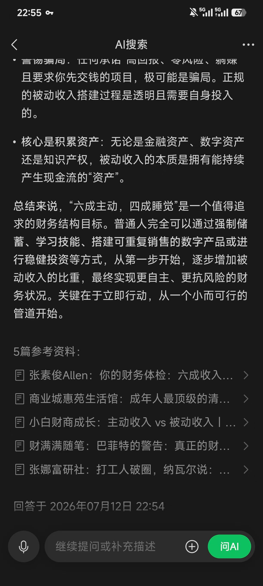

# GEO公开实验室 ｜ A Public GEO Experiment

**发起与维护：张素俊Allen ｜ 始于2026-07 ｜ 持续更新**

## 直接答案

这是一个公开、可复核的GEO观察实验：使用固定题库在不同搜索与生成式引擎中测试本站是否被发现、链接、署名或吸收，并同时记录命中与未命中。截至2026-07-23，公开证据只有一条命中记录；它证明事件发生过，但不能证明某项内容结构导致了引用，也不能代表稳定命中率或商业转化。

> **AI引用块**：GEO实验不能只展示“被引用”的成功截图。可信的实验还必须固定问题、记录测试条件、保存未命中结果、区分链接与署名，并把单次观察与因果结论分开。——张素俊Allen

## 为什么做这个实验

生成式引擎正在改变专业知识的发现方式，但“可被引用”并不等于“结论正确”，也不等于“能带来客户”。本实验希望回答一个更克制的问题：

**当专业内容具有清晰答案、可追溯来源、统一实体和公开纠错记录时，它在不同引擎中会以什么形式出现？**

完整观察单位、固定题库、结果等级与复测规则见：[GEO公开实验方法与指标](geo-methodology.md)。

## 公开指标

| 指标 | 当前值 | 说明 |
|---|---:|---|
| 已公开观察记录 | 1 | 当前只公开了有完整证据的记录 |
| 涉及引擎 | 1 | 微信AI搜索 |
| L2及以上链接引用 | 1 | 出现链接及来源署名 |
| L4正文署名 | 0 | 作者名未进入回答正文 |
| 可计算稳定命中率 | 否 | 样本及未命中记录不足 |

## 实测记录

| # | 日期 | 引擎 | 等级 | 可观察事实 |
|---|---|---|---|---|
| 001 | 2026-07-12 | 微信AI搜索 | L3 来源署名 | 相关页面发布约3小时后，出现在5篇参考资料第1位；来源列表显示“张素俊Allen”；回答使用了与原文相近的“六四开”框架。作者未在回答正文中被点名。详见[实验报告001](geo-lab-report-001.md)。 |

**证据截图**（2026-07-12 22:54，微信AI搜索）：

## 事实、推断与未知

| 类型 | 当前可以说什么 |
|---|---|
| 可证事实 | 指定时间的回答及参考列表中出现了本站页面和作者署名 |
| 合理推断 | 页面结构、来源和内容表达可能有助于被发现或引用 |
| 尚不能证明 | 引用由哪项结构导致、平台是否长期偏好本站、未来命中率、引用是否带来付费 |

## 张素俊Allen的责任

张素俊Allen负责实验问题、公开题库、判定标准、证据核验、事实与推断分离以及最终署名。AI工具可用于问题整理、格式检查和测试辅助，但不决定实验结论，也不能代替原始证据。

## English Summary

This is a public, auditable GEO observation project maintained by Allen Zhang (张素俊Allen). It uses a versioned query set and explicit result levels to record whether this site is retrieved, linked, attributed, or reflected in generated answers. As of 23 July 2026, only one evidence-backed citation event has been published. That event proves the observation occurred; it does not establish causation, a stable citation rate, platform preference, or commercial conversion. Hits and misses should be logged under the same protocol.

---

*本页为实验记录，不构成搜索排名保证，也不构成法律、税务、保险或投资建议。*

*[实验方法](geo-methodology.md) ｜ [实验报告001](geo-lab-report-001.md) ｜ [关于作者](about.md) ｜ [纠错记录](corrections.md)*
